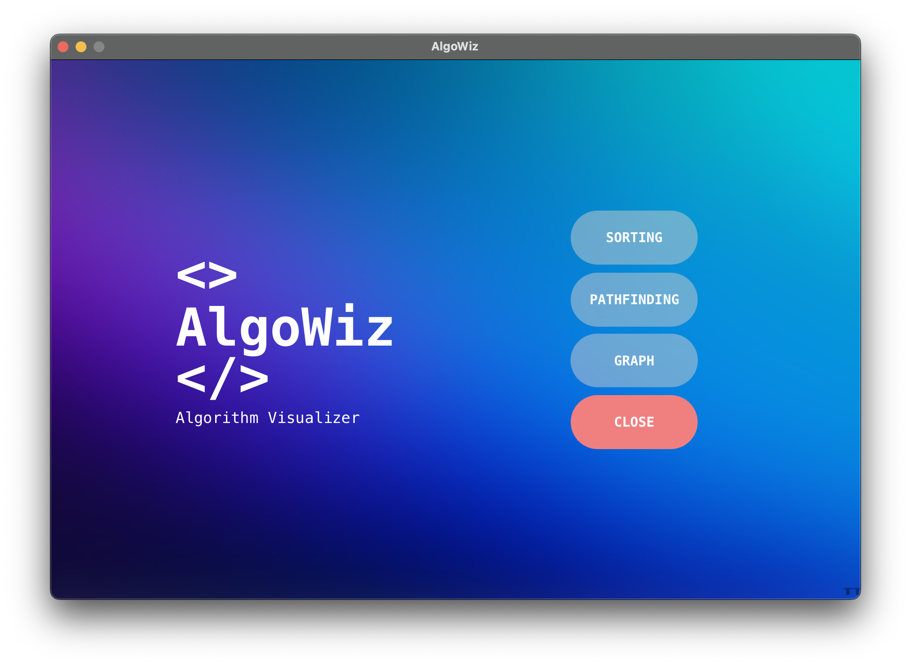
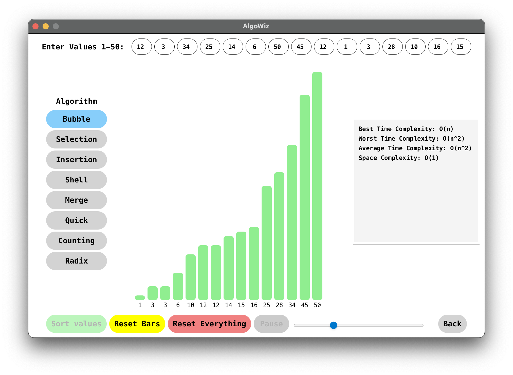

## Overview
Algorithm Visualizer is a JavaFX application designed to visualize various algorithms to aid in understanding their inner workings. This project provides a visual representation of algorithms such as sorting, path finding and graph traversal. With interactive animations and step-by-step execution, users can observe how algorithms operate in real-time.

## Features
- **Interactive Visualization**: Visualize algorithms with interactive animations to understand their behavior better.
- **Step-by-Step Execution**: Execute algorithms step-by-step to see how they progress through each iteration.
- **Multiple Algorithms**: Implementations of various algorithms including sorting (e.g. bubble sort, merge sort etc), path finding (e.g. BFS, DFS, Dijkstra etc), and graph algorithms (e.g., DFS, BFS, Dijkstra etc).
- **Customizable Parameters**: Adjust parameters such as array size, animation speed, and input data to tailor the visualization experience.
- **User-Friendly Interface**: Intuitive UI design for seamless interaction and easy navigation.

## Algorithms
**Sorting**
1. Bubble sort
2. Selection sort
3. Insertion sort
4. Shell sort
5. Merge sort
6. Quick sort
7. Counting sort
8. Radix sort

**Path Finding (Maze Solving)**
1. BFS
2. DFS
3. Dijkstra's Algorithm

**Graph**
1. BFS
2. DFS
3. Dijkstra's Algorithm
4. MST

## How to Run
1. Clone the repo to your local machine.
```bash
git clone https://github.com/taxin1/AlgorithmVisualizer.git
```
2. Open it in your preferred IDE and setup JavaFX.
3. Then add the following JAR files to your dependencies. They can be found under the folders `jar_files`, `jar_files_2` and `jar_files_3`. If your're using IntelliJ then navigate to `File > Project Structure > Project Settings > Modules > Dependencies`. Then add the JARs under `Dependencies`.
  - `controlsfx-11.2.1.jar`
  - `jfoenix-21.0.0.jar`
  - `jfxtras-common-17-r1.jar`
4. Run `AlgorithmVisualizerMenu.java`.

## Screenshots
### Start Screen

### Sorting - Data Added

### Sorting - Data Sorted

### Path Finding - Maze Created

### Path Finding - Maze Solved

### Graph


## Acknowledgements
This is made as the final project for CSE 4402: Visual Programming Lab.

**Team publicStaticVoidMain**

[Tahsin Bin Reza | 210041106](https://github.com/taxin1)

[Rafiul Arefeen Islam | 210041114](https://github.com/rafiul-arefeen)

[Adib Ahmed | 210041122](https://github.com/AdibOmi)
